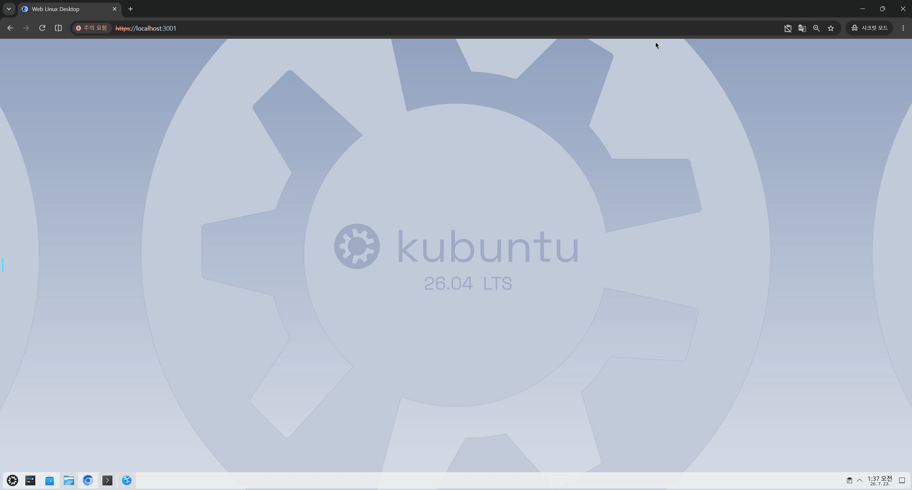
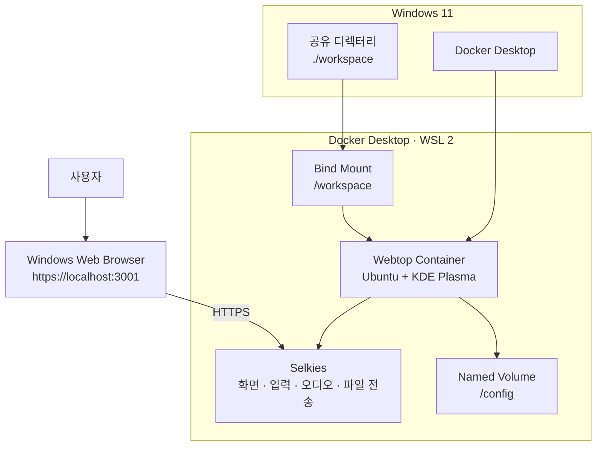
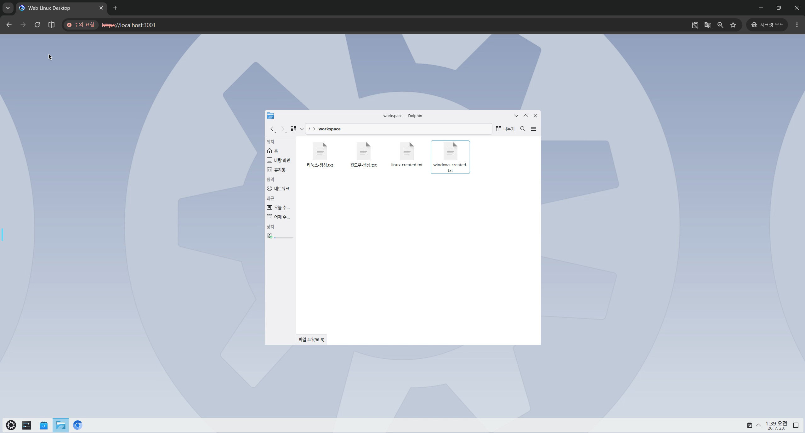
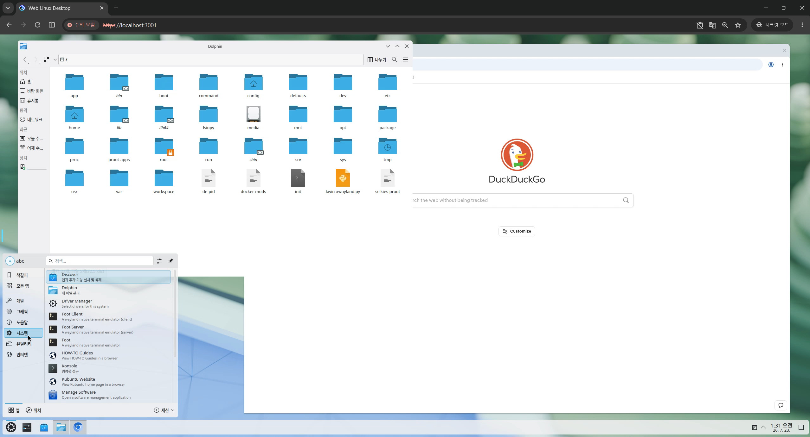
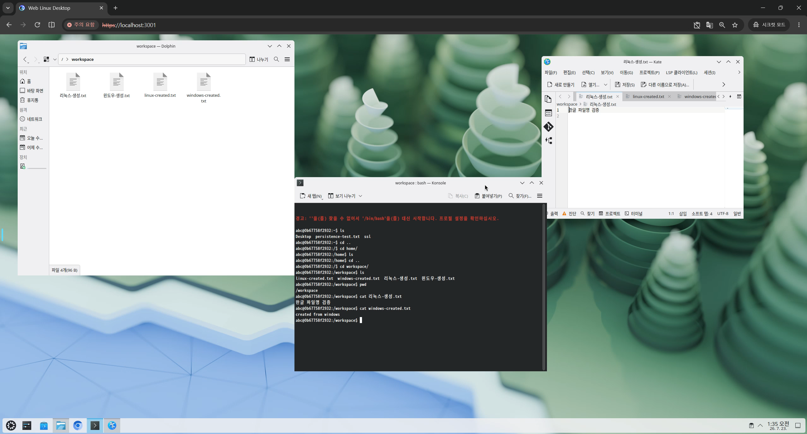
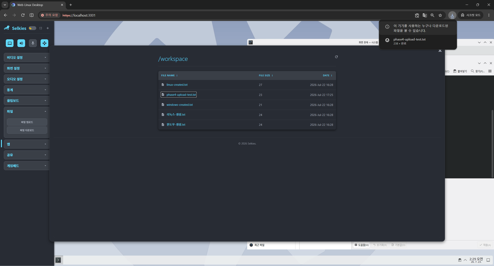

# Web Linux Desktop

> Windows에 Linux 데스크톱을 별도로 설치하지 않고, Docker Desktop에서 실행되는 KDE Plasma 환경을 웹 브라우저로 사용하는 프로젝트

[🌐 프로젝트 정리 슬라이드](https://seoheejung.github.io/web-linux-desktop/)



## 프로젝트 개요

Web Linux Desktop은 Windows 11의 Docker Desktop 환경에서 LinuxServer.io Webtop 컨테이너를 실행하고, 브라우저에서 KDE Plasma 데스크톱을 사용하는 프로젝트입니다.

듀얼 부팅이나 별도 Linux PC, 가상 머신 없이 Docker Desktop의 WSL 2 백엔드를 사용합니다. Selkies가 KDE Plasma의 화면, 입력, 오디오, 파일 전송 기능을 Windows 브라우저에 전달합니다.

```text
Windows 11
→ Docker Desktop
→ WSL 2
→ Webtop Ubuntu KDE 컨테이너
→ KDE Plasma
→ Selkies
→ Windows 웹 브라우저
```

---

## 시스템 구조



| 구성 요소 | 역할 |
| --- | --- |
| Docker Desktop | Windows에서 Linux 컨테이너 실행 |
| WSL 2 | Docker Desktop의 Linux 백엔드 |
| Webtop | Ubuntu 기반 KDE Plasma 환경 제공 |
| Selkies | 브라우저 화면·입력·오디오·파일 전송 |
| `/config` | 사용자 홈과 KDE 설정 저장 |
| `/workspace` | Windows와 Linux 사이의 파일 공유 |

---

## 기술 구성

| 구분 | 값 |
| --- | --- |
| 호스트 운영체제 | Windows 11 |
| 컨테이너 실행 환경 | Docker Desktop |
| Docker 백엔드 | WSL 2 |
| 컨테이너 이미지 | `lscr.io/linuxserver/webtop:ubuntu-kde` |
| 이미지 build version | `dbe53151-ls172` |
| 데스크톱 환경 | KDE Plasma |
| 세션 유형 | Wayland |
| X11 호환 계층 | Xwayland |
| 웹 데스크톱 기술 | Selkies |
| 접속 주소 | `https://localhost:3001` |
| 인증 방식 | HTTP Basic 인증 |
| 사용자 데이터 | Docker named volume |
| 공유 파일 | Windows bind mount |

---

## 프로젝트 구조

```text
web-linux-desktop/
├── compose.yaml
├── .env.example
├── .gitignore
├── README.md
├── docs/
│   ├── index.html
│   ├── phase1.md
│   ├── phase2.md
│   ├── phase3.md
│   └── phase4.md
├── images/
└── workspace/
    └── .gitkeep
```

| 경로 | 역할 |
| --- | --- |
| `compose.yaml` | Webtop 컨테이너 실행 설정 |
| `.env.example` | 인증 환경 변수 형식 |
| `docs/` | Phase별 작업 기준과 검증 기록 |
| `images/` | Phase별 실행 화면 |
| `workspace/` | Windows와 Linux 공유 디렉터리 |
| `/config` | Webtop 사용자 홈과 KDE 설정 |
| `/workspace` | 컨테이너 내부 공유 경로 |

---

## 실행 방법

### 1. 환경 변수 파일 생성

```powershell
Copy-Item .env.example .env
```

`.env`에 로컬 인증 정보를 작성합니다.

```dotenv
WEBTOP_USER=webtop
WEBTOP_PASSWORD=로컬에서-사용할-비밀번호
```

`.env`는 Git 추적 대상에서 제외합니다.

### 2. Compose 구성 확인

```powershell
docker compose config
```

### 3. 이미지 다운로드 및 실행

```powershell
docker compose pull
docker compose up -d
```

### 4. 실행 상태 확인

```powershell
docker compose ps
```

### 5. 브라우저 접속

```text
https://localhost:3001
```

자체 서명 인증서 경고를 통과한 뒤 `.env`에 작성한 사용자명과 비밀번호로 인증합니다.

---

## 주요 운영 명령

```powershell
# 실행
docker compose up -d

# 중지
docker compose stop

# 기존 컨테이너 재실행
docker compose start

# 재시작
docker compose restart webtop

# 컨테이너 재생성
docker compose down
docker compose up -d

# 로그 확인
docker compose logs --tail 200 webtop
```

영속성 검증이 필요한 경우 volume 삭제 옵션을 사용하지 않습니다.

```powershell
docker compose down -v
```

---

## 검증 결과

### Webtop 실행

| 검증 항목 | 결과 |
| --- | --- |
| Webtop 컨테이너 실행 | 성공 |
| HTTPS 접속 | 성공 |
| HTTP Basic 인증 | 성공 |
| KDE Plasma 화면 | 정상 |
| 실제 Session type | `wayland` |
| RestartCount | `0` |
| `/config` 마운트 | Docker volume |
| `/workspace` 마운트 | Windows bind mount |

확인된 주요 프로세스:

```text
kwin_wayland
plasmashell
Xwayland
selkies
nginx
pulseaudio
```

---

### Windows·Linux 파일 공유

```text
linux-created.txt
windows-created.txt
리눅스-생성.txt
윈도우-생성.txt
```

| 검증 항목 | 결과 |
| --- | --- |
| Linux → Windows 영문 파일 | 성공 |
| Windows → Linux 영문 파일 | 성공 |
| Linux → Windows 한글 파일명 | 성공 |
| Windows → Linux 한글 파일명 | 성공 |
| 한글 파일 내용 | 정상 |
| 공유 파일 Git 제외 | 확인 |

---

### 데이터 및 설정 영속성



| 검증 항목 | 결과 |
| --- | --- |
| 컨테이너 재시작 후 `/config` 유지 | 성공 |
| 컨테이너 재시작 후 `/workspace` 유지 | 성공 |
| 컨테이너 재시작 후 KDE 설정 유지 | 성공 |
| 컨테이너 재생성 후 `/config` 유지 | 성공 |
| 컨테이너 재생성 후 `/workspace` 유지 | 성공 |
| 컨테이너 재생성 후 KDE 설정 유지 | 성공 |

KDE 바탕화면 설정과 `/config/persistence-test.txt`가 컨테이너 재생성 후에도 유지됐습니다.

---

### 화면 및 입력

| 검증 항목 | 결과 |
| --- | --- |
| Selkies 가상 해상도 | `3840 × 2160` |
| 화면 형식 | 4K UHD |
| UI 스케일링 | `100%` |
| HiDPI | 활성화 |
| 전체 화면 진입·해제 | 성공 |
| 창 이동 | 성공 |
| 창 크기 변경 | 성공 |
| 영문 입력 | 성공 |
| 숫자 입력 | 성공 |
| 한글 직접 입력 | 성공 |
| 한글 조합 | 정상 |
| 한·영 전환 | 성공 |
| KDE 한국어 UI | 정상 |
| 한글 파일명 표시 | 정상 |

해상도는 Windows 물리 모니터가 아니라 Selkies가 Webtop 가상 데스크톱에 제공한 값입니다.

Fcitx, IBus, Nimf, Kime 프로세스와 입력기 환경 변수는 확인되지 않았습니다. 한글 입력은 정상 동작했으며, Windows 호스트 입력이 브라우저를 거쳐 Webtop에 전달된 것으로 추정합니다.

---

### 클립보드 및 파일 전송

| 검증 항목 | 결과 |
| --- | --- |
| Windows → Webtop 클립보드 | 실패 |
| Webtop → Windows 클립보드 | 성공 |
| Windows → Webtop 파일 업로드 | 성공 |
| Webtop → Windows 파일 다운로드 | 성공 |
| Windows 다운로드 폴더 파일 확인 | 성공 |

클립보드는 단방향만 동작했습니다. 파일 전송은 Selkies 업로드·다운로드 기능으로 정상 처리됐습니다.

---

### 오디오

| 검증 항목 | 결과 |
| --- | --- |
| 내부 브라우저 실행 | 성공 |
| 웹 페이지 접속 | 성공 |
| 오디오 콘텐츠 재생 | 성공 |
| Windows 오디오 출력 | 성공 |
| 확인 페이지 | 네이버 |
| YouTube 홈페이지 접속 | 성공 |
| YouTube 영상 재생 | 확인하지 못함 |

네이버 페이지에서 실제 오디오 출력을 확인했습니다.

---

## 자원 측정 결과

모든 값은 `docker stats web-linux-desktop`의 순간 측정값입니다.

| 측정 상태 | Session type | CPU | MEM USAGE / LIMIT | MEM % | PIDs |
| --- | --- | ---: | ---: | ---: | ---: |
| KDE 초기 화면 | `wayland` | `11.94%` | `1.185GiB / 9.711GiB` | `12.21%` | `173` |
| 터미널 1개 | `wayland` | `21.50%` | `1.22GiB / 9.711GiB` | `12.56%` | `216` |
| 내부 브라우저 1개 | `wayland` | `46.01%` | `1.505GiB / 9.711GiB` | `15.50%` | `330` |
| Dolphin 1개 | `wayland` | `23.95%` | `1.26GiB / 9.711GiB` | `12.98%` | `224` |
| 동영상·오디오 재생 | `wayland` | `126.67%` | `1.551GiB / 9.711GiB` | `15.97%` | `347` |

Webtop의 공식 최소 CPU·메모리 요구량은 확인되지 않았습니다. 임의 합격 기준이나 성능 평가는 적용하지 않고 실제 측정값만 기록했습니다.

---

## 실행 화면

### KDE Plasma 및 애플리케이션



### Windows·Linux 공유 파일



### 재생성 후 데이터 유지


### Selkies 파일 다운로드



---

## Phase 진행 상태

| Phase | 범위 | 상태 |
| --- | --- | --- |
| Phase 1 | 프로젝트 초기 구성 | 완료 |
| Phase 2 | Webtop 실행 및 브라우저 접속 | 완료 |
| Phase 3 | Linux 데스크톱 사용 및 파일 공유 | 완료 |
| Phase 4 | 사용성·자원 검증 및 문서화 | 완료 |

## Phase 지시서

- [Phase 1 — 프로젝트 초기 구성](./docs/phase1.md)
- [Phase 2 — Webtop 실행 및 브라우저 접속](./docs/phase2.md)
- [Phase 3 — Linux 데스크톱 사용 및 파일 공유](./docs/phase3.md)
- [Phase 4 — 사용성 및 자원 검증](./docs/phase4.md)

---

## 확인된 한계

- 최초 HTTPS 접속 시 자체 서명 인증서 경고 표시
- Windows → Webtop 클립보드 붙여넣기 실패
- Linux 내부 한글 입력기 프레임워크 미확인
- Discover 실행 시 PackageKit 권한 오류 발생
- YouTube 영상 재생 미확인
- 대규모 소스 트리와 파일 I/O 성능 미검증
- GPU 가속 미적용

Webtop은 독립 Linux PC나 가상 머신이 아닙니다. Docker Desktop의 WSL 2 환경에서 실행되는 컨테이너이므로 BIOS·UEFI 부팅, GRUB, initramfs, 독립 커널 관리 기능은 제공하지 않습니다.

---

## 보안 기준

- HTTPS `3001` 포트만 사용
- `127.0.0.1` loopback 주소에만 연결
- HTTP `3000` 포트 미노출
- `.env` Git 제외
- 실제 인증 정보 문서 기록 금지
- 외부 네트워크 공개 금지
- Docker 소켓 미마운트
- `privileged` 모드 미사용
- `seccomp:unconfined` 미사용
- GPU 장치 미마운트

HTTP Basic 인증은 로컬 접근 제한 용도이며 인터넷 공개용 인증 체계로 사용하지 않습니다.

---

## 참고 자료

- [Docker Desktop WSL 2 백엔드](https://docs.docker.com/desktop/features/wsl/)
- [Docker Desktop WSL 모범 사례](https://docs.docker.com/desktop/features/wsl/best-practices/)
- [LinuxServer.io Webtop](https://docs.linuxserver.io/images/docker-webtop/)
- [LinuxServer.io Selkies Base Image](https://docs.linuxserver.io/images/docker-baseimage-selkies/)
- [Docker Volume](https://docs.docker.com/engine/storage/volumes/)
- [Docker Bind Mount](https://docs.docker.com/engine/storage/bind-mounts/)