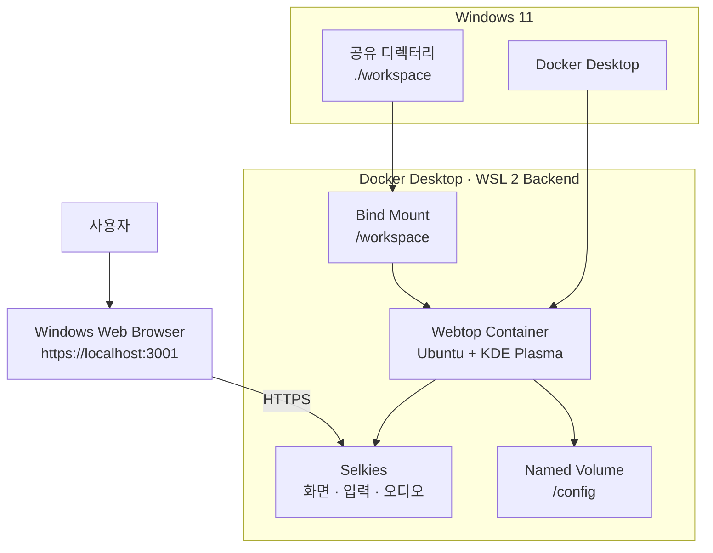

# Web Linux Desktop

> Windows에 Linux 데스크톱 운영체제를 별도로 설치하지 않고, Docker Desktop에서 실행되는 KDE Plasma 환경을 웹 브라우저로 사용하는 프로젝트

## 프로젝트 개요

Web Linux Desktop은 Windows 11의 Docker Desktop 환경에서 LinuxServer.io Webtop 컨테이너를 실행하고, Windows 웹 브라우저에서 Ubuntu 기반 KDE Plasma 데스크톱을 사용하는 프로젝트입니다.

듀얼 부팅, 별도 Linux PC, Hyper-V·VirtualBox 기반 가상 머신을 구성하지 않습니다. Docker Desktop의 WSL 2 백엔드에서 Linux 데스크톱 컨테이너를 실행하며, 브라우저를 통해 화면과 입력을 전달받습니다.

```text
Windows 11
→ Docker Desktop
→ WSL 2 Linux 컨테이너 환경
→ Webtop Ubuntu KDE 컨테이너
→ Selkies
→ Windows 웹 브라우저
→ KDE Plasma
```

---

## 주요 목표

* Docker Desktop 기반 Webtop 컨테이너 실행
* Windows 브라우저에서 KDE Plasma 접속
* Linux 터미널, 파일 관리자, 브라우저 사용
* Windows와 Linux 컨테이너 간 파일 공유
* 컨테이너 재생성 후 사용자 설정 유지
* 한국어 표시와 한글 입력 확인
* 클립보드, 파일 전송, 오디오 동작 확인
* Wayland 또는 X11 실제 세션 유형 기록
* CPU와 메모리 사용량 측정

---

## 시스템 구조



### 구성 요소

| 구성 요소          | 역할                       |
| -------------- | ------------------------ |
| Docker Desktop | Windows에서 Linux 컨테이너 실행  |
| WSL 2          | Docker Desktop Linux 백엔드 |
| Webtop         | Ubuntu 기반 KDE Plasma 제공  |
| Selkies        | 브라우저 화면·입력·오디오 전달        |
| `/config`      | Webtop 사용자 설정과 홈 데이터 저장  |
| `/workspace`   | Windows와 Linux 사이의 파일 공유 |

---

## 기술 구성

| 구분         | 값                                       |
| ---------- | --------------------------------------- |
| 호스트 운영체제   | Windows 11                              |
| 컨테이너 실행 환경 | Docker Desktop                          |
| Docker 백엔드 | WSL 2                                   |
| 컨테이너 이미지   | `lscr.io/linuxserver/webtop:ubuntu-kde` |
| 데스크톱 환경    | KDE Plasma                              |
| 웹 데스크톱 기술  | Selkies                                 |
| 접속 주소      | `https://localhost:3001`                |
| 사용자 데이터    | Docker named volume                     |
| 공유 파일      | Windows bind mount                      |

---

## 프로젝트 구조

```text
web-linux-desktop/
├── compose.yaml
├── .env.example
├── .gitignore
├── README.md
├── docs/
│   ├── phase1.md
│   ├── phase2.md
│   ├── phase3.md
│   └── phase4.md
└── workspace/
    └── .gitkeep
```

| 경로             | 역할                     |
| -------------- | ---------------------- |
| `compose.yaml` | Webtop 컨테이너 실행 설정      |
| `.env.example` | 인증 환경 변수 형식            |
| `docs/`        | Phase별 작업 및 검증 기록      |
| `workspace/`   | Windows와 Linux 공유 디렉터리 |
| `/config`      | Webtop 사용자 홈과 KDE 설정   |
| `/workspace`   | 컨테이너 내부 공유 경로          |

Phase 작업에 필요한 파일만 생성하며, 이후 Phase 파일을 미리 생성하지 않습니다.

---

## 사전 준비

* Windows 11
* WSL 2.1.5 이상
* Docker Desktop
* Linux containers 모드
* Docker Compose
* Git
* Chrome, Edge 또는 Firefox

### 환경 확인

```powershell
wsl --version
wsl --status

docker version
docker info
docker compose version
```

Docker Desktop 메뉴에 `Switch to Linux containers`가 표시되면 Windows containers 모드로 실행 중입니다. Linux containers 모드로 전환해야 합니다.

---

## 환경 변수 설정

`.env.example`

```dotenv
WEBTOP_USER=webtop
WEBTOP_PASSWORD=change-me
```

로컬 환경 변수 파일을 생성합니다.

```powershell
Copy-Item .env.example .env
```

`.env`의 사용자명과 비밀번호를 로컬 값으로 변경합니다.

```dotenv
WEBTOP_USER=webtop
WEBTOP_PASSWORD=로컬-비밀번호
```

* `change-me` 상태로 실행하지 않습니다.
* `.env`는 Git에 포함하지 않습니다.
* 실제 인증 정보는 문서에 기록하지 않습니다.

---

## Docker Compose 구성

```yaml
services:
  webtop:
    image: lscr.io/linuxserver/webtop:ubuntu-kde
    container_name: web-linux-desktop
    environment:
      PUID: "1000"
      PGID: "1000"
      TZ: Asia/Seoul
      LC_ALL: ko_KR.UTF-8
      TITLE: Web Linux Desktop
      CUSTOM_USER: ${WEBTOP_USER}
      PASSWORD: ${WEBTOP_PASSWORD}
      FILE_MANAGER_PATH: /workspace
    volumes:
      - webtop_config:/config
      - ./workspace:/workspace
    ports:
      - "127.0.0.1:3001:3001"
    shm_size: "1gb"
    restart: unless-stopped

volumes:
  webtop_config:
```

### 주요 설정

| 설정                             | 역할                  |
| ------------------------------ | ------------------- |
| `127.0.0.1:3001:3001`          | Windows 로컬 HTTPS 접속 |
| `webtop_config:/config`        | 사용자 설정 영속화          |
| `./workspace:/workspace`       | Windows·Linux 파일 공유 |
| `FILE_MANAGER_PATH=/workspace` | 파일 전송 기본 경로         |
| `LC_ALL=ko_KR.UTF-8`           | 한국어 로케일 설정          |
| `CUSTOM_USER`, `PASSWORD`      | HTTP Basic 인증       |

HTTP `3000` 포트는 노출하지 않습니다.

---

## 실행 방법

### Compose 문법 확인

```powershell
docker compose config
```

### 이미지 다운로드

```powershell
docker compose pull
```

### 컨테이너 실행

```powershell
docker compose up -d
```

### 상태 확인

```powershell
docker compose ps
```

### 로그 확인

```powershell
docker compose logs -f webtop
```

---

## 브라우저 접속

```text
https://localhost:3001
```

Webtop은 자체 서명 인증서를 사용하므로 최초 접속 시 브라우저 인증서 경고가 표시될 수 있습니다.

경고를 통과한 후 `.env`에 설정한 사용자명과 비밀번호를 입력합니다.

---

## 주요 경로

| 경로            | 저장 방식               | 역할                  |
| ------------- | ------------------- | ------------------- |
| `/config`     | Docker named volume | 사용자 홈과 KDE 설정       |
| `/workspace`  | Windows bind mount  | Windows·Linux 공유 파일 |
| `./workspace` | Windows 디렉터리        | 공유 파일 실제 위치         |

`/config`와 `/workspace`는 역할을 분리해 사용합니다.

---

## 운영 명령

### 실행

```powershell
docker compose up -d
```

### 중지

```powershell
docker compose stop
```

### 재실행

```powershell
docker compose start
```

### 컨테이너 제거

```powershell
docker compose down
```

### 컨테이너 터미널 접속

```powershell
docker exec -it web-linux-desktop /bin/bash
```

### 이미지 업데이트

```powershell
docker compose pull
docker compose up -d
```

영속성 검증 중에는 named volume을 제거하는 명령을 사용하지 않습니다.

```powershell
docker compose down -v
```

---

## 진행 단계

| Phase   | 범위                    | 상태    |
| ------- | --------------------- | ----- |
| Phase 1 | 프로젝트 초기 구성            | 진행 예정 |
| Phase 2 | Webtop 실행 및 브라우저 접속   | 진행 예정 |
| Phase 3 | Linux 데스크톱 사용 및 파일 공유 | 진행 예정 |
| Phase 4 | 사용성·자원 검증 및 문서화       | 진행 예정 |

세부 작업 과정과 검증 결과는 `docs/phase1.md`부터 `docs/phase4.md`까지 분리해 관리합니다.

---

## 검증 예정 항목

* Windows 브라우저 HTTPS 접속
* HTTP Basic 인증
* KDE Plasma 화면 출력
* Linux 터미널, 파일 관리자, 브라우저 실행
* Wayland 또는 X11 실제 세션 유형
* Windows·Linux 파일 공유
* `/config` 사용자 데이터 영속성
* 한국어 표시와 한글 입력
* 클립보드 공유
* 파일 업로드·다운로드
* 브라우저 오디오 출력
* CPU와 메모리 사용량
* 이미지 Repo digest와 build version

실행하지 않은 결과나 측정하지 않은 값은 README에 기록하지 않습니다.

---

## 보안 기준

* HTTPS `3001` 포트만 사용
* `127.0.0.1` loopback 주소에만 연결
* HTTP `3000` 포트 미노출
* `.env` Git 제외
* 외부 네트워크 공개 금지
* Docker 소켓 미마운트
* `privileged` 모드 미사용
* `seccomp:unconfined` 기본 미사용
* GPU 장치 미마운트

HTTP Basic 인증은 로컬 환경의 접근 제한 용도입니다. 인터넷 공개용 인증 체계로 사용하지 않습니다.

---

## 구현 범위 제외

* Linux 듀얼 부팅
* 별도 Linux PC
* Hyper-V 또는 VirtualBox Linux VM
* BIOS·UEFI 부팅
* GRUB·initramfs 복구
* 독립 Linux 커널 관리
* GPU 가속
* 외부 네트워크 공개
* 리버스 프록시
* 다중 사용자 세션
* Docker-in-Docker
* Docker 소켓 마운트
* 사용자 정의 Webtop 이미지
* Dockerfile
* 자동 백업·복원
* 자동 이미지 업데이트
* 컨테이너 운영체제 전체 업그레이드

---

## 기술적 한계

Webtop 컨테이너는 독립적으로 부팅되는 Linux PC나 Linux 가상 머신이 아닙니다.

Docker Desktop의 WSL 2 Linux 환경 위에서 컨테이너 프로세스로 실행되므로 BIOS·UEFI 부팅, GRUB, initramfs, 독립 커널 관리, 실제 GPU 드라이버 설치 기능을 제공하지 않습니다.

Windows bind mount는 소규모 파일 공유에 사용하며, 대규모 빌드나 파일 I/O 성능 검증은 프로젝트 범위에 포함하지 않습니다.

---

## 참고 자료

* Docker Desktop WSL 2 백엔드
  https://docs.docker.com/desktop/features/wsl/

* Docker Desktop WSL 모범 사례
  https://docs.docker.com/desktop/features/wsl/best-practices/

* LinuxServer.io Webtop
  https://docs.linuxserver.io/images/docker-webtop/

* LinuxServer.io Selkies Base Image
  https://docs.linuxserver.io/images/docker-baseimage-selkies/

* Docker Volume
  https://docs.docker.com/engine/storage/volumes/

* Docker Bind Mount
  https://docs.docker.com/engine/storage/bind-mounts/
